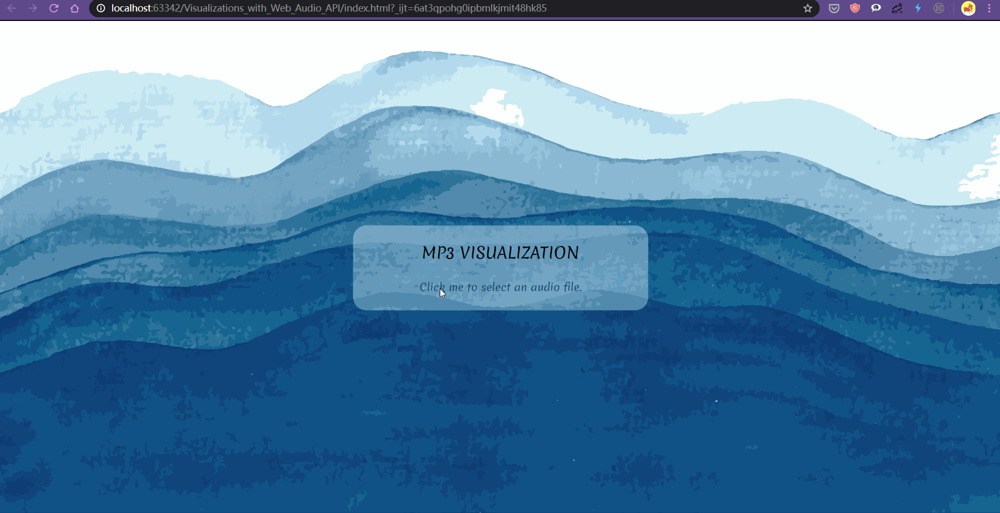

# MP3 VISUALIZATION

This is a music visualization tool using Audio Context API.

The effect is defined in **js/bubble.js**

## Usage

Download the files directly, you can modify **js/bubble.js** to create your visualizer

## Demo

[Click Here!](https://gnahcihsuil.github.io/Visualizations_with_Web_Audio_API/)

## Reference

1. [Visualizations with Web Audio API](https://gnahcihsuil.github.io/Visualizations_with_Web_Audio_API/)

